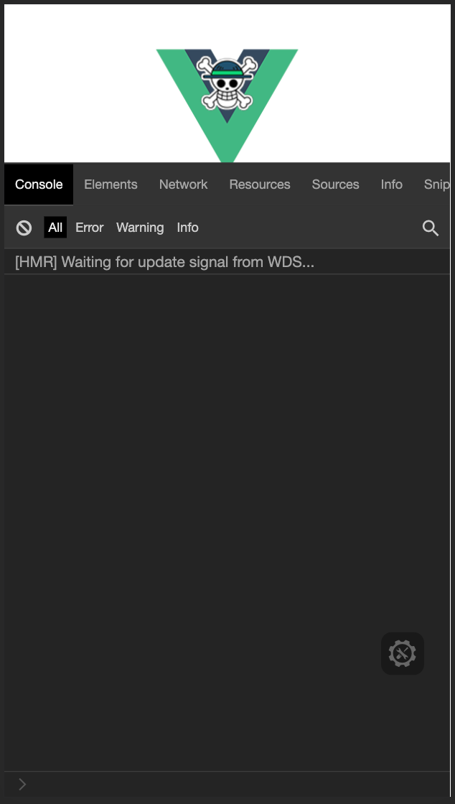

 **🌱基于 Vue3 全家桶、Vant3，vw 视口适配，开箱即用的移动端项目基础模板**

- [x] Vue3✨
- [x] Vant3✨
- [x] 支持 SVG 图标自动注册组件✨
- [x] vw 视口适配
- [x] Axios 封装
- [x] 开发环境 Mock 数据
- [x] ESLint
- [x] 首屏加载动画
- [x] 项目资源路径 alias 别名
- [x] 开发环境调试面板
- [x] Vuex 集成
- [x] Vue-router 集成


## 在线预览Preview

👓 [点击这里](https://yulimchen.github.io/vue3-h5-template/)（PC浏览器请切换手机端模式）


## 截图


## 运行项目

```shell
# 克隆项目
git clone https://github.com/yulimchen/vue3-h5-template.git

# 进入项目目录
cd vue3-h5-template

# 安装依赖
yarn
# OR
npm install

# 启动服务
yarn serve
# OR
npm run serve
```


## 文档引导

> - [按需引入 vant 组件](#vant)
> - [SVG 图标使用](#svg)
> - [路由缓存&命名注意⚠](#router)
> - [调试面板 eruda](#console)
> - [动态设置页面标题](#page-title)
>


### - <span id="vant">按需引入 vant 组件</span>

全量引入组件库太过臃肿，这里进行了按需引入，需要增加组件的话在`registerVant.js`中添加即可。

```js
// src/plugins/registerVant.js

// 下面示例增加 Tabbar、TabbarItem 这两个组件
import {
  // ...
  Tabbar,
  TabbarItem
} from 'vant'

const componentList = [
  // ...
  Tabbar,
  TabbarItem
]

// ...
```


### - <span id="svg">SVG 图标使用</span>

这里用了花裤衩大佬的 svg 解决方案，有兴趣详细了解可以点击[文章](https://juejin.cn/post/6844903517564436493)。

> 1. 将 svg 图标文件放在`src/icons/svg`目录下
> 2. 在项目中直接使用`<svg-icon icon-class="svg图标文件命名" />`即可

例如：

本项目`src/icons/svg`中放了个叫`check-in.svg`的图标文件，然后在组件`icon-class`属性中填入文件的命名即可，So easy~

```Vue
<svg-icon icon-class="check-in" />
```


### - <span id="router">路由缓存&命名注意⚠</span>

组件默认开启缓存，如某个组件需关闭缓存，在对应路由 routes meta 内的`noCache`字段赋值为`true`即可。

```js
{
  path: '/about',
  name: 'About',
  component: () => import('@/views/about'),
  meta: {
    noCache: true
  }
},
```

> PS. 为了保证页面能被正确缓存，请确保**组件**的`name`值和对应路由的`name`命名完全相同。


### - <span id="console">调试面板 eruda</span>



为了方便移动端查看 log 信息和调试，开发环境引入了 eruda 调试面板的 cdn。如果你的开发环境不需要的话请在 `.env.development` 中修改值：

```html
# .env.development

# 开发环境启用 eruda 调试台。若不启用，将 true 修改为 false 或其他任意值即可
VUE_APP_ENABLE_ERUDA = true
```


### - <span id="page-title">动态设置页面标题</span>

在路由全局前置守卫中：

```js
// src/router/index.js
// ...
router.beforeEach((to, from, next) => {
  // ...
  // 设置页面 title
  setPageTitle(to.meta.title)
  next()
})
```

具体实现方法见文件 `src/utils/set-page-title.js` 。


### - <span id="mock">开发环境Mock</span>

> 本项目 Mock 是在本地开启 server，如果开发环境不需要 mock 数据，请在 `vue.config.js` 中注释 `before` 字段 ，并重启项目。

```js
// vue.config.js
module.exports = {
  // ...
  devServer: {
    // 删除或注释 before 键值即可
    before: require('./mock/mock-server.js')
  }
}
```


## 鸣谢

 [vue-element-admin](https://github.com/PanJiaChen/vue-element-admin) 

 [vant-demo](https://github.com/youzan/vant-demo) 