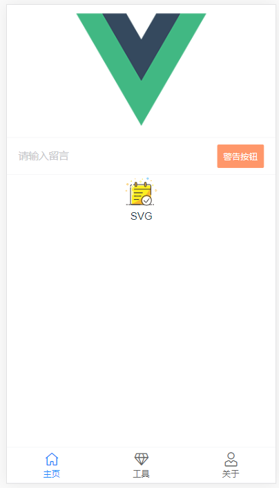

 **🌱基于 vue3、vant3，vw/vh 视口适配，开箱即用的移动端项目基础模板**

- [x] vue3✨
- [x] vant3✨
- [x] 支持 svg 图标自动注册组件✨
- [x] vw/vh 视口适配
- [x] 首屏加载动画
- [x] 项目资源路径 alias 别名
- [x] 开发环境调试面板
- [ ] axios 封装 (TODO)
- [ ] vuex (TODO)


## 在线预览Preview

👓 [点击这里](https://yulimchen.github.io/vue3-h5-template/)（PC浏览器请切换手机端模式）


## 截图




## 运行项目

```shell
# 克隆项目
git clone https://github.com/yulimchen/vue3-h5-template.git

# 进入项目目录
cd vue3-h5-template

# 安装依赖
yarn
# OR
npm install

# 启动服务
yarn serve
# OR
npm run serve
```


## 文档引导

### 按需引入 vant 组件

全量引入组件库太过臃肿，这里进行了按需引入，需要增加组件的话在`registerVant.js`中添加即可。

```js
// src/plugins/registerVant.js

// 下面示例增加 Tabbar、TabbarItem 这两个组件
import {
  // ...
  Tabbar,
  TabbarItem
} from 'vant'

const componentList = [
  // ...
  Tabbar,
  TabbarItem
]

// ...
```


### SVG 图标使用

这里用了花裤衩大佬的 svg 解决方案，有兴趣详细了解可以点击[文章](https://juejin.cn/post/6844903517564436493)。

> 1. 将 svg 图标文件放在`src/icons/svg`目录下
> 2. 在项目中直接使用`<svg-icon icon-class="svg图标文件命名" />`即可

例如：

本项目`src/icons/svg`中放了个叫`check-in.svg`的图标文件，然后在组件`icon-class`属性中填入文件的命名即可，So easy~

```Vue
<svg-icon icon-class="check-in" />
```


### 调试面板 eruda


为了方便移动端查看 log 信息和调试，开发环境引入了 eruda 调试面板的 cdn。如果你的开发环境不需要的话请在 `index.html`中删除以下代码：

```html
<!-- public/index.html -->

<% if (NODE_ENV === 'development') { %>
    <!-- console -->
    <script src="//cdn.jsdelivr.net/npm/eruda"></script>
    <script>
      eruda.init();
    </script>
<% } %>
```

